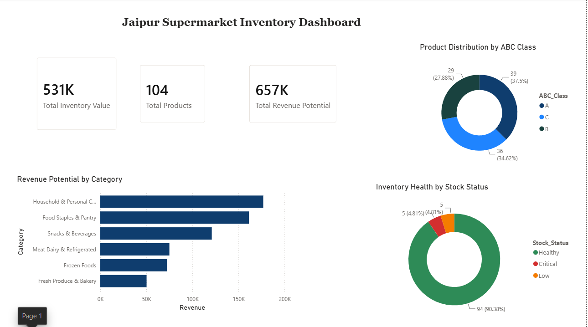
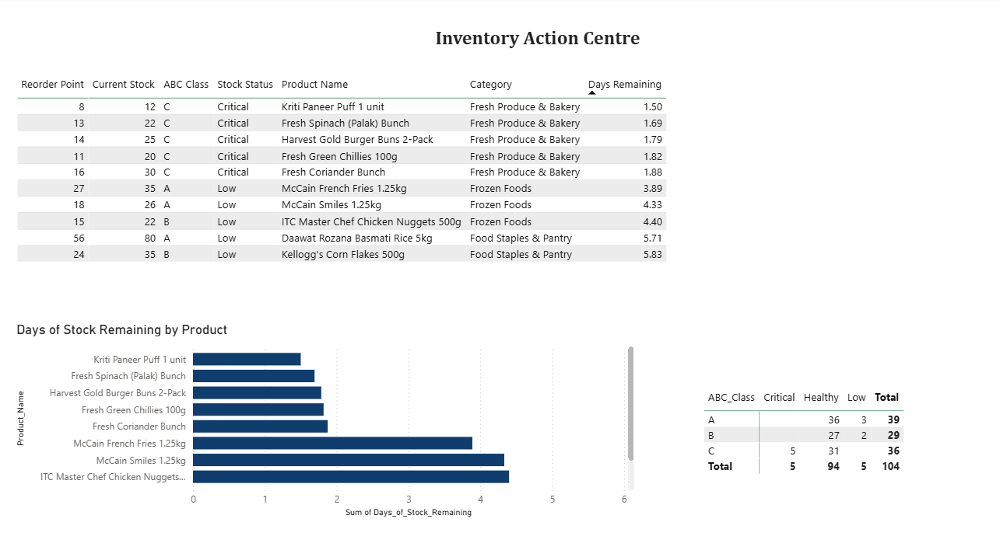

# 🛒 Jaipur Supermarket Inventory Optimization Dashboard

## Problem
Small supermarket owners typically manage inventory through guesswork and manual counting — they rarely know which products are critically low until shelves are already empty, or which slow-moving products are silently tying up their working capital. This project was built to solve both problems.

## Data
A custom dataset of 104 products was built across 6 realistic Indian supermarket categories. All pricing, sales velocity, and lead time values were calibrated to reflect realistic Indian retail patterns.

**Categories:** Fresh Produce & Bakery | Meat Dairy & Refrigerated | Food Staples & Pantry | Snacks & Beverages | Frozen Foods | Household & Personal Care

## Tools Used
- **Excel** — Reorder Point, Days of Stock Remaining, Stock Status calculations
- **SQL (MySQL)** — 4 business queries including CASE WHEN and ROLLUP
- **Python (pandas)** — EDA and ABC Analysis
- **Power BI** — 2-page interactive dashboard

## Key Findings
- 5 Critical and 5 Low stock products identified out of 104 total
- All 5 Critical products are in Fresh Produce & Bakery — most perishable category
- All Critical products are ABC Class C — no high-revenue products at risk
- 39 products (Class A) drive 70% of total revenue potential (₹4,57,695)
- Frozen Foods has highest dead stock concentration — 7 slow-moving products

## Recommendations
1. Reorder all 5 Critical products in next regular supplier delivery
2. Monitor Class A products daily — stockout on these has outsized revenue impact
3. Run promotions on slow-moving Frozen Foods to recover tied-up cash
4. Review dashboard daily (Action Centre) and weekly (Overview)

## Business Impact
- Total Inventory Value: ₹5,31,062
- Total Revenue Potential: ₹6,57,169
- Gross Profit Opportunity: ₹1,26,107
- Better inventory decisions protect this margin and improve daily cash flow

## Dashboard Preview

